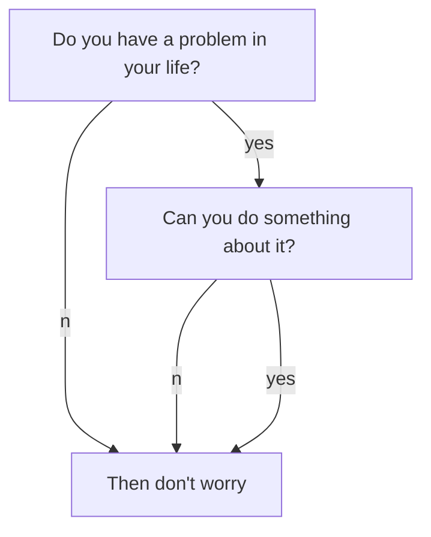

<!-- https://kitian616.github.io/jekyll-TeXt-theme/docs/en/markdown-enhancements -->



```chart
{
  "type": "polarArea",
  "data": {
    "datasets": [
      {
        "data": [
          11,
          16,
          7,
          3,
          14
        ],
        "backgroundColor": [
          "#FF6384",
          "#4BC0C0",
          "#FFCE56",
          "#E7E9ED",
          "#36A2EB"
        ],
        "label": "My dataset"
      }
    ],
    "labels": [
      "Red",
      "Green",
      "Yellow",
      "Grey",
      "Blue"
    ]
  },
  "options": {}
}
```

[BUTTON](https://github.com/fromzerosystems){:.button.button--primary.button--pill}

<div class="card">
  <div class="card__content">
    <div class="card__header">
      <h4>Photograph</h4>
    </div>
    <p>...</p>
  </div>
</div>
